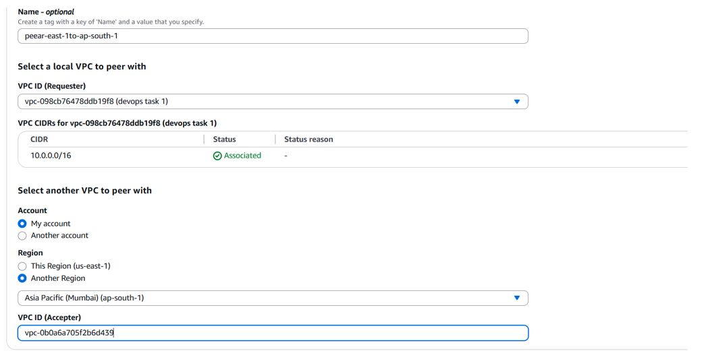
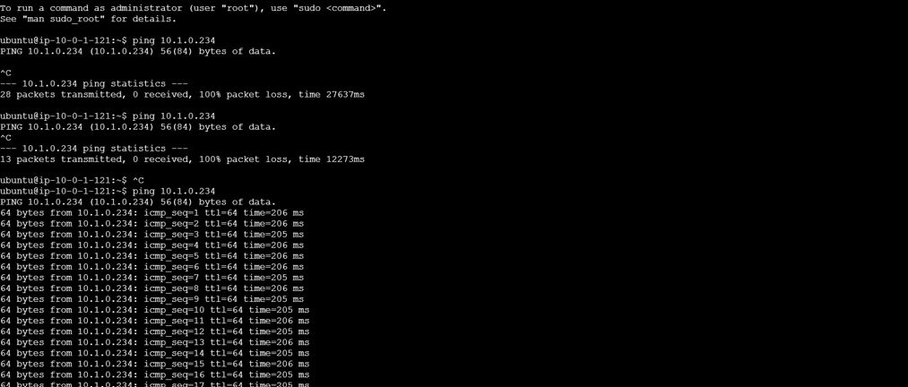
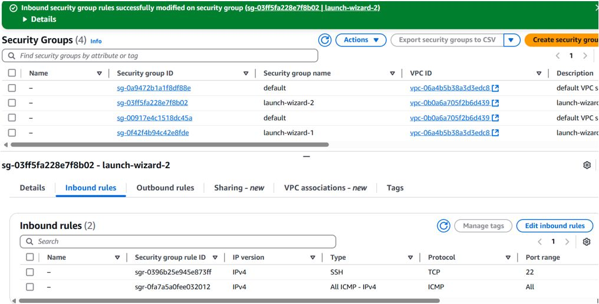
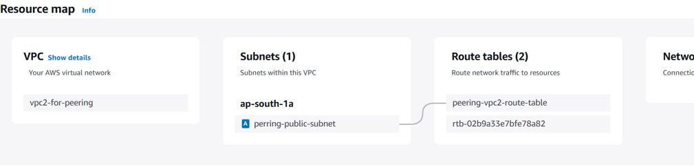

# AWS VPC Peering and Cloud Networking Configuration

## Overview

This document outlines the setup of **VPC Peering** in AWS to enable secure, low-latency, and private communication between two Virtual Private Clouds (VPCs). VPC Peering is essential for cross-VPC traffic where resources must interact without traversing the public internet.

---

## Steps Followed

### 1. Create Two VPCs
- Created two separate **VPCs** (e.g., VPC-A and VPC-B) in the same or different AWS regions.
- Ensured **non-overlapping CIDR blocks** to avoid routing conflicts.
  - Example:
    - VPC-A: `10.0.0.0/16`
    - VPC-B: `192.168.0.0/16`

### 2. Initiate VPC Peering Request
- From VPC-A, initiated a **VPC Peering Connection** to VPC-B.
- Selected the target VPC using its ID and confirmed region compatibility.
- Added a request message (optional) for identification.

### 3. Accept the Peering Connection
- Navigated to VPC-B and **accepted** the pending peering request.
- Verified the **Active** status of the peering connection after acceptance.

### 4. Route Table Configuration
- Modified the **route tables** of both VPCs to add routes pointing to the peer network.
  - In VPC-A’s route table, added:
    - Destination: `192.168.0.0/16`
    - Target: Peering Connection ID
  - Similarly updated VPC-B’s route table for `10.0.0.0/16`.

### 5. Security Groups and Access
- Updated **security groups** in both VPCs to allow traffic from the peer VPC’s CIDR range.
- Ensured the necessary ports (e.g., SSH, HTTP) were open for testing purposes.

### 6. Verification
- Launched EC2 instances in both VPCs.
- Verified connectivity using private IPs (e.g., ping, SSH).
- Confirmed that the traffic was routed internally via the peering connection, not over the public internet.

---

## Summary

VPC Peering is a robust solution for enabling private network communication between AWS environments. It’s especially useful in **multi-VPC architectures**, **cross-account setups**, or **hybrid cloud scenarios**.

---

## Screenshots

---

## References

- [VPC Peering Guide – AWS Docs](https://docs.aws.amazon.com/vpc/latest/peering/what-is-vpc-peering.html)
- [Best Practices for VPC Networking](https://docs.aws.amazon.com/vpc/latest/userguide/vpc-best-practices.html)

---

*Documentation created by Aditya Kumar*
